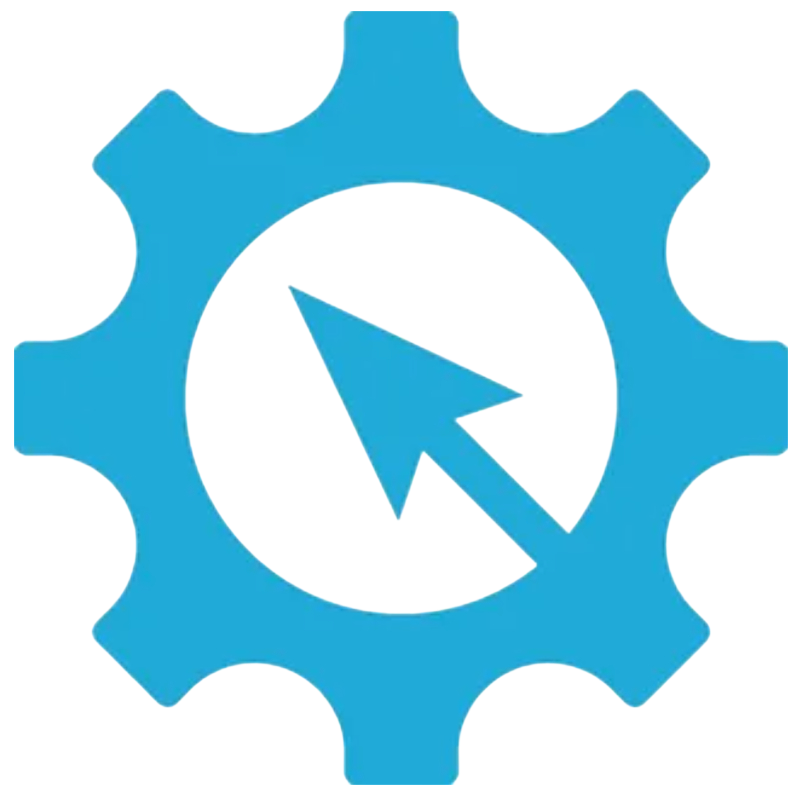

# Андрей Сажнев | Andrey Sazhnev
### RPA Architect · Руководитель направления внутренней автоматизации

📍 Астрахань, Россия · 📧 [ausazhnev@gmail.com](mailto:ausazhnev@gmail.com)

 

> *"Что сделано хорошо — сделано навсегда. Что сделано наспех — вернётся как долг."*
> — *принцип Священных Шаблонных Конструкций*

 

---

## ⚙️ Обо мне

Более **20 лет в IT**, последние **4 года — в RPA**. Проектирую и строю корпоративные RPA-экосистемы с нуля: от анализа бизнес-процесса до передачи в эксплуатацию и масштабирования.

Моя инженерная философия опирается на концепцию **СШК — Священных Шаблонных Конструкций**. Подобно инженерной доктрине *Adeptus Mechanicus*, я верю, что надёжная автоматизация строится не на хаотичных скриптах, а на стандартизированных, проверенных в «боевых» условиях паттернах, которые переиспользуются, версионируются и передаются из проекта в проект.

Я не изобретаю велосипеды там, где нужна надёжность. Я создаю **стандарты**, по которым команда работает быстрее и безопаснее.

---

## 🏆 Ключевые достижения

| Проект | Роль | Результат |
|--------|------|-----------|
| 🏗️ Построение RPA-экосистемы с нуля | Архитектор и разработчик | Запуск RPA-направления в организации. Личная разработка ключевых узлов: интеграция почты с ERP, триггерная обработка файлов в СХД, сбор аналитики с веб-ресурсов в условиях отсутствия API |
| 🏭 Интеграция RPA в автоматизированный процесс | Архитектор и ведущий разработчик | Бесшовное внедрение RPA силами внутренней команды (без внешних подрядчиков и модификации смежных систем). Сокращение времени обработки **в 3 раза** (с 8 мин до 2:30), экономия **>3 FTE** |
| 📊 Архитектура Master-Processor | Архитектор и Tech Lead | Внедрение паттерна Master-Processor: создание отказоустойчивого ядра для масштабирования до **более чем сотни роботов** без дорогостоящего рефакторинга. Бизнес-результат: освобождение сотрудников от рутины, **минимизация ошибок** и **сокращение времени реагирования** на запросы партнёров и клиентов |
| 🧠 Интеграция RAG в бизнес-процессы | Архитектор и разработчик | End-to-end реализация системы RAG для корпоративных баз знаний: от постановки задачи до внедрения. Сокращение времени поиска информации на **~70%** |
| 📚 Библиотека паттернов (СШК) | Автор и ментор | Создание единой библиотеки стандартизированных RPA-компонентов на основе опыта корпоративных внедрений. Проект в активной разработке |

---

##  Технологический стек

**RPA & Оркестрация**

**Языки & Скриптование**

**Интеграции & Данные**

**AI & Инновации**

**Процессы**

---

## 📜 Манифест инженера (СШК)

> *"Что сделано хорошо — сделано навсегда. Что сделано наспех — вернётся как долг."*

Мои принципы, которым я следую в каждом проекте:

1. **🔨 Стандартизация важнее изобретательности.** Если паттерн работает — он попадает в библиотеку. Если нет — он не попадает в продакшн.

2. **📖 Документация — часть кода.** BPMN-диаграммы, инструкции, описания решений. Недокументированное решение — это технический долг.

3. **🔄 Переиспользование — это уважение.** К каждому следующему проекту я отношусь так, будто буду его поддерживать 10 лет. Библиотека паттернов растет с каждым решением.

4. **🛡️ Надёжность важнее скорости.** Лучше потратить день на проектирование и тестирование, чем неделю на исправление ошибок в продакшене. RPA-робот работает 24/7 — он должен быть надежным.

5. **👥 Менторство масштабирует.** Один сильный архитектор ценен, но команда, которая мыслит как архитектор — бесценна. Делимся знаниями, проводим code review, растим инженеров.

---

## 🎯 Текущий фокус (2026)

- 🔭 **Развитие библиотеки СШК-паттернов:** добавляю паттерны для работы с AI-агентами и гибридной оркестрацией
- 🤖 **Интеграция LLM-агентов в классические RPA-потоки:** изучаю и применяю на практике
- 🤝 **Менторство junior/middle RPA-разработчиков:** построение инженерной культуры в команде
- 📝 **Публикация архитектурных кейсов:** обезличенные примеры решений в этом профиле (без NDA-данных)

---

## 💼 Что я приношу в команду

- **Архитектуру**, которая переживёт смену технологий и масштабирование.
- **Стандарты**, благодаря которым новый разработчик начинает приносить пользу за 2 недели, а не за 3 месяца.
- **Менторство** — я не просто пишу код, я выращиваю инженеров и выстраиваю культуру Code Review.
- **Язык общения с бизнесом** — умею переводить абстрактные "хотелки" в чёткое ТЗ, а ТЗ — в измеримый бизнес-результат (FTE, время, деньги).

---

## 📜 Сертификаты и повышение квалификации

*(Сканы сертификатов доступны в папке `assets/certificates/` данного репозитория)*

### 🧠 AI и машинное обучение
- **Разработчик AI-агентов** — Университет Искусственного Интеллекта, 2026
- **Дообучение AI-агентов на базе знаний (RAG)** — Университет Искусственного Интеллекта, 2026
- **GPT Engineer** — Университет Искусственного Интеллекта, 2025

### 🤖 RPA и автоматизация
- **Проектирование архитектуры RPA-решений** — Академия "Шерпа Роботикс", 2024
- **AI-агенты в RPA: разработка на платформе Sherpa AI Server** — Академия "Шерпа Роботикс", 2024
- **RPA-разработчик (Sherpa RPA)** — Академия "Шерпа Роботикс", 2023

### 💻 Платформенная разработка
- **Разработка конфигураций на платформе 1С 7.7** — Авторизованный Центр Сертификационного Обучения фирмы "1С", 2006

---

## 🤝 Открыт к предложениям

Ищу роли, где смогу максимально применить свой опыт:

- 🏗 **RPA Architect** — проектирование корпоративных экосистем с нуля.
- 👨‍💼 **Head of Internal Automation** — построение направления, процессов и команды.
- 🎓 **Ведущий архитектор / Ментор** — проекты, где критически важен опыт и передача знаний.

**Формат:** Удалённо или релокация · Полная занятость, также открыт к консультациям.

---

*«Opus machinae, gloria disciplinae.»*  
*(Труд машины — слава дисциплины.)*

📧 [ausazhnev@gmail.com](mailto:ausazhnev@gmail.com)  

